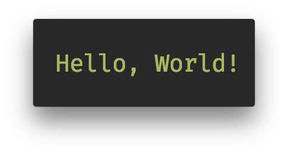
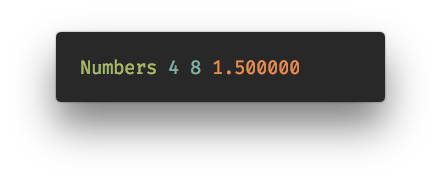
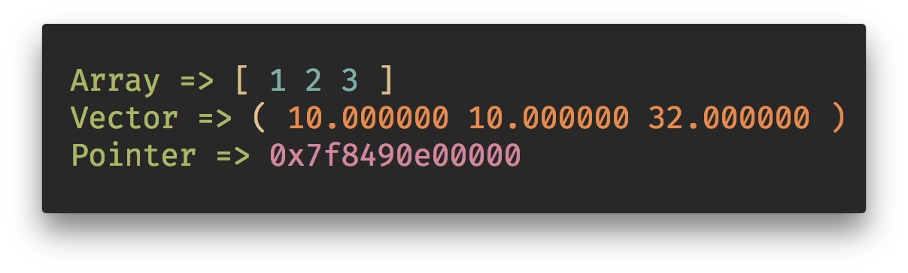

# print.h

Generic print comes to C made for `z_` inspired by many that came before.

---

3 months ago I saw [Generic-Print](https://github.com/exebook/generic-print)  in the [r/C_Programming](https://www.reddit.com/r/C_Programming/) subreddit. I set my first foot into C `macros` and then [Hirrolot](https://github.com/Hirrolot)'s [Metatlang99](https://github.com/Hirrolot/metalang99) and [Datatype99](https://github.com/Hirrolot/datatype99) pushed me the world of meta-programming.

<br>

This repository is a homage to them and their hardwork.
3 months I did not even knew Python-style generic print was even possible for C let alone making it. Projects such as [P99](https://gitlab.inria.fr/gustedt/p99), [Cloak](https://github.com/pfultz2/Cloak), [Metatlang99](https://github.com/Hirrolot/metalang99) have made it possible.

---

<br>

Before Delving into, I want to make it clear that this repo, just solely is to preview the `print.h`.
The `print.h` is already is in the [**z_**](https://github.com/zakarouf/z_) Library. So, please use the `z_` library instead.

Or Use [Generic-Print](https://github.com/exebook/generic-print) instead.

### Printing with print.h

**`print.h`** requires the [z_](https://github.com/zakarouf/z_) Library to work

```c
#include "print.h"
z__print("Hello, World!");
```
> Output <br>


##### Printing Primitive Types.

```c
#include "print.h"

int a = 4, b = a+a;
char str[] = "Numbers";

z__print(str, a, b, 3.0f/2);
```
> Output <br>
> 

##### Printing `z_` Types.
```c
#include "print.h"

z__Vector3 cord = {{10, 10, 32}};
z__u32Arr array_num = z__Arr_init(z__u32Arr , 1, 2, 3);
void *F = array_num.data;

z__print("Array =>", array_num, "\n",
         "Vector =>", cord, "\n",
         "Pointer =>", F);
```
> Output


#### See also

* [Generic-Print](https://github.com/exebook/generic-print)
* [P99](https://gitlab.inria.fr/gustedt/p99)
* [Cloak](https://github.com/pfultz2/Cloak)
* [Metatlang99](https://github.com/Hirrolot/metalang99)
* [Datatype99](https://github.com/Hirrolot/datatype99)
